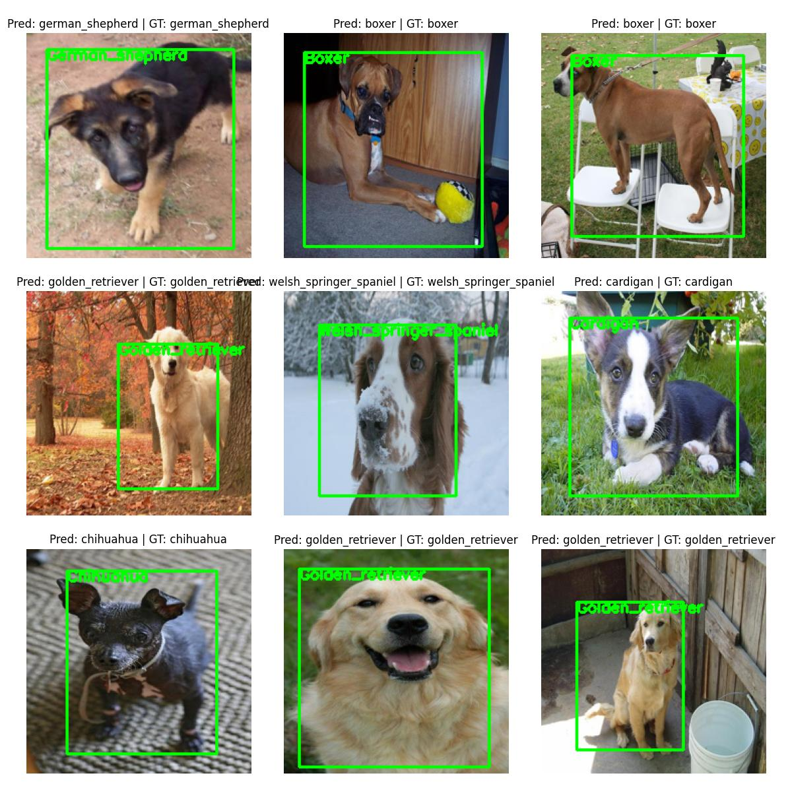

# Custom Object Detector

### Dataset
- Stanford Dogs Mini 10 (Original full dataset with 120 classes: [LINK](http://vision.stanford.edu/aditya86/ImageNetDogs/))
- Single object per image
- Annotations are class label and bounding box

### Model info

- Uses ResNet50 as backbone
- Added a custom full connected layers for classification and bounding box regression
- Parameters:
    - Total params: 25,097,646
    - Trainable params: 1,589,614
    - Non-trainable params: 23,508,032

### Visualization

- Dataset samples

    

- Model training curves

    

- Model predictions

    


### Requirements

```shell
pip install -r requirements.txt
```

### How to use

- Step 1: Dataset preparation using `convert_voc_to_yolo.py`

- Step 2: 
    - [option1] Run full code using jupyter notebook `full_code.ipynb`

    - [option2] Using python script
    
        ```shell
        # Train the model
        python train.py

        # Test and inference
        python inference.py 
        ```

### Updates

- ~~add tensorboard~~
- ~~add mAP metric from torchmetrics~~
- ~~make modular code~~
- ~~save best model based on validation loss~~
- ~~separate inference script~~
- ~~Add description~~
- ~~Add input output images~~

### Reference
```
@article{Chakraborty2021Feb,
	author = {Chakraborty, Devjyoti},
	title = {Training an object detector from scratch in PyTorch},
	journal = {PyImageSearch},
	year = {2021},
	month = feb,
	urldate = {2023-10-03},
	url = {https://pyimagesearch.com/2021/11/01/training-an-object-detector-from-scratch-in-pytorch}
}
```
