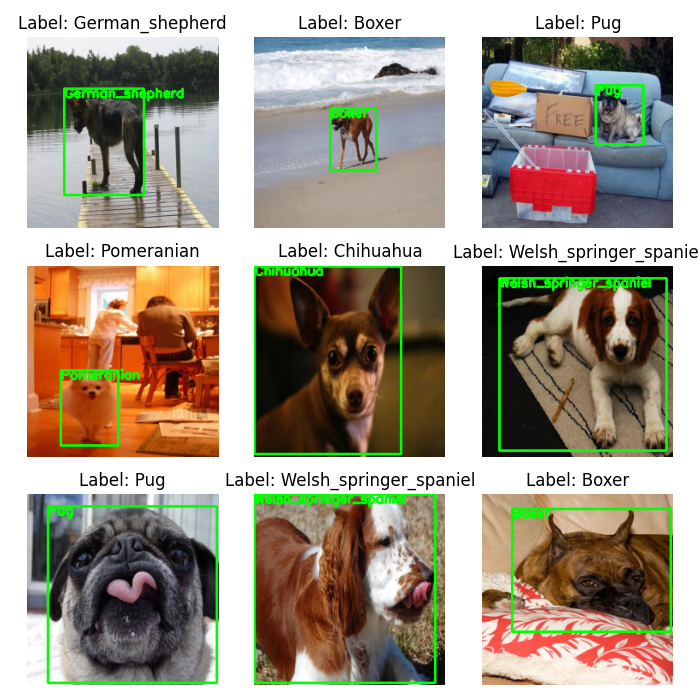

# Custom Object Detector

| |
|:--:|
| *Model overview, [source](https://pyimagesearch.com/2021/11/01/training-an-object-detector-from-scratch-in-pytorch/)* |

### Dataset

- Stanford Dogs Mini 10 (Original full dataset with 120 classes: [LINK](http://vision.stanford.edu/aditya86/ImageNetDogs/))
- Single object per image
- Annotations are class label and bounding box

### Model info

- Model architecture graph is available [HERE](https://github.com/kvnptl/visual_perception/blob/main/object_detection/custom_object_detector/images/customDetector_model_architecture.svg)
- Uses ResNet50 as backbone
- Added a custom full connected layers for classification and bounding box regression
- Parameters:
  - Total params: 25,097,646
  - Trainable params: 1,589,614
  - Non-trainable params: 23,508,032

### Visualization

- Dataset samples

    

- Model training curves

    

- Model predictions

    

### Requirements

```shell
pip install -r requirements.txt
```

### How to use

- Step 1: Dataset preparation using `convert_voc_to_yolo.py`

- Step 2:
  - [option1] Run full code using jupyter notebook `full_code.ipynb`

  - [option2] Using python script

        ```shell
        # Train the model
        python train.py

        # Test and inference
        python inference.py 
        ```

### Updates

- [x] add tensorboard
- [x] add mAP metric from torchmetrics
- [x] make modular code
- [x] save best model based on validation loss
- [x] separate inference script
- [x] Add description
- [x] Add input output images

### Reference

```
@article{Chakraborty2021Feb,
 author = {Chakraborty, Devjyoti},
 title = {Training an object detector from scratch in PyTorch},
 journal = {PyImageSearch},
 year = {2021},
 month = feb,
 urldate = {2023-10-03},
 url = {https://pyimagesearch.com/2021/11/01/training-an-object-detector-from-scratch-in-pytorch}
}
```
