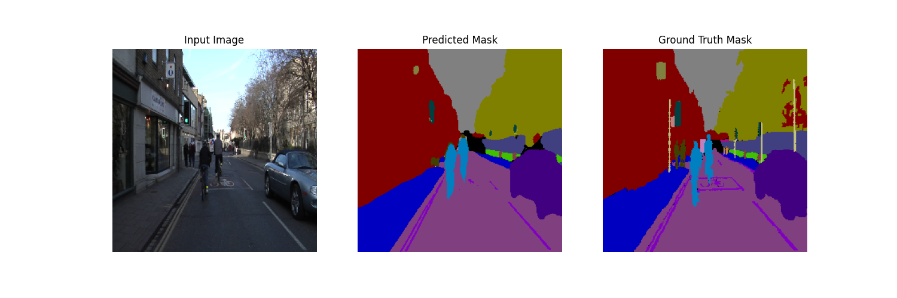
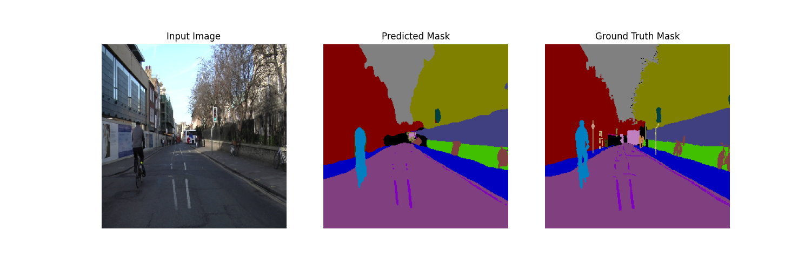
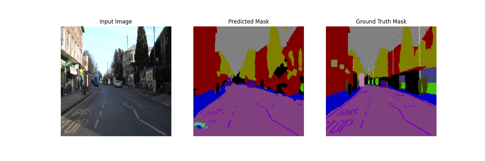
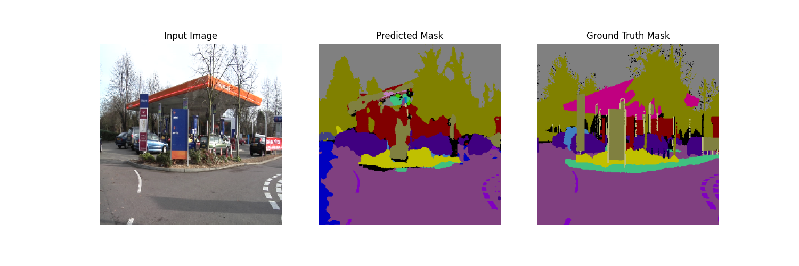
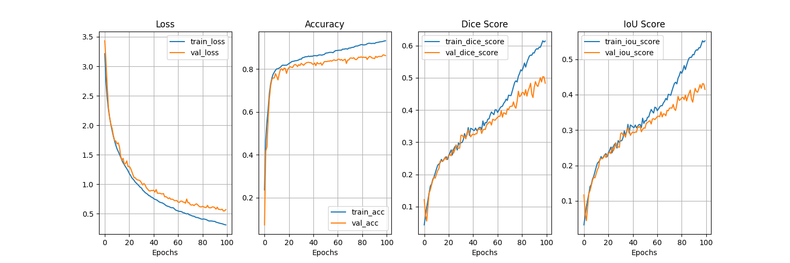

## UNet based semantic segmentation on CamVid dataset

The project is structured to facilitate training a U-Net [Ronneberger et al.][1] model for segmenting driving scenes from CamVid dataset [Brostow et al.][2], providing both standalone Python scripts and a Jupyter notebook for interactive experimentation. This setup is ideal for those interested in applying deep learning to real-world vision tasks in autonomous driving and related fields.

- Visualize the UNet model architecture graph here: [Network Graph (SVG)](media/unet_model_graph.gv.svg)

## Results

<p float="left">
  
  <br>
  
  <br>
  
  <br>
  
</p>

## Loss and accuracy curves

<p float="left">
  
</p>

## Dataset

- CamVid (Cambridge-Driving Labeled Video Database): <https://www.kaggle.com/datasets/carlolepelaars/camvid>
- The dataset is split up as follows:
  - 367 training pairs
  - 101 validation pairs
  - 233 test pairs
- 32 classes

## Functionalities

- Store best model based on val loss
- Plot loss and accuracy curves
- Config file to store hyperparameters
- Produce detailed model summary
- Modularize code

## How to train U-Net on CamVid dataset

- Run train script:

  ```bash
  python train.py <GPUDeviceIndex>
  ```

  - Check results in `results` folder, it should have model checkpoints, loss and accuracy curves, and sample val predictions

## TODO

- [x] Model monitoring code
  - [x] Loss curves, Accuracy curves
- [x] Train with bigger image size, e.g. 512x512
- [x] Add regularization to prevent overfitting, i.e. dropout
- [ ] (if possible) Integrate focal loss to mitigate class imbalance
- [ ] Add IoU loss for semantic segmentation
- [ ] Add learning rate scheduler
- [ ] Add early stopping
- [ ] Fix Tensorboard logging
- [ ] Add result table with metrics

## References

[1]: Ronneberger, Olaf, Philipp Fischer, and Thomas Brox. "U-net: Convolutional networks for biomedical image segmentation." Medical image computing and computer-assisted intervention–MICCAI 2015: 18th international conference, Munich, Germany, October 5-9, 2015, proceedings, part III 18. Springer International Publishing, 2015.

[2]: Brostow, Gabriel J., Julien Fauqueur, and Roberto Cipolla. "Semantic object classes in video: A high-definition ground truth database." Pattern recognition letters 30.2 (2009): 88-97.
